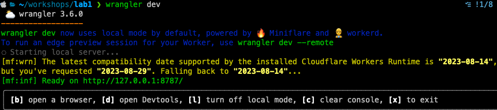
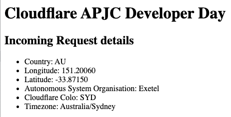
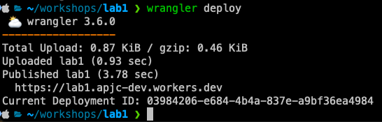
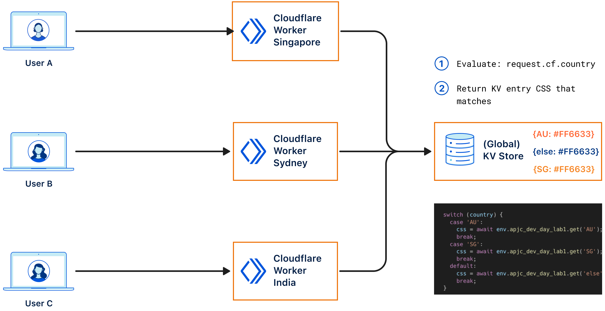
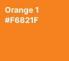
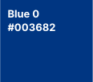

# Lab 1 - Building with Wrangler and integrating KV

In this lab we are going to explore how to use Wrangler to develop a Worker on our local machine, then deploy that Worker to the Cloudflare Edge. The topics that will be covered in this lab are as follows:

- Generating a Worker locally
- Publishing the Worker to the Edge
- Creating a KV Namespace and binding that to our Worker
- (optional) Adding a Custom Domain to your Worker

Using Wrangler is one of the easiest methods to interact with Cloudflare's Developer Platform from the comfort of the CLI. Make sure you're running the latest version, as per our [releases page](https://github.com/cloudflare/workers-sdk/releases).

## Generating a Worker with Wrangler

### Creating a simple Hello World Worker

The Worker we will deploy today will generate a simple web page about your connection request. It will be built using the [Module Worker Syntax](https://blog.cloudflare.com/workers-javascript-modules/), which is increasingly becoming our de-facto standard for deploying newer workers so they can take advantage of other services, such as Durable Objects.

```{admonition} Wrangler Installed and Authenticated
:class: Important
Please ensure Wrangler is installed locally and authenticated as described in the [Wrangler setup guide](./wrangler.md)
```

So let's get started:

From your terminal navigate to a directory where you'd like to host your Worker's files, and then follow the steps below:

1. Generate a "Hello World" skeleton by initializing a basic Worker project with the following command and options:

```bash
npm create cloudflare@2 -- lab1

What type of application do you want to create?
 type "Hello World" script

Do you want to use TypeScript?
 typescript no

Do you want to deploy your application?
│ no

APPLICATION CREATED  Deploy your application with npm run deploy
```

The above command has initialized a basic Worker's project, with the following directory structure at the top level:

```bash
tree -L 1
.
├── node_modules
├── package-lock.json
├── package.json
├── src
└── wrangler.toml

3 directories, 3 files
```

The `src` directory contains the JavaScript for your very first Worker, and will be the file we use to write our code to. The second file of interest is `wrangler.toml` at the top level, this file is used to inform Wrangler which accounts, which bindings, and custom routes we'd like to use for our project. We will modify this file throughout this lab as required.

2. Next let's change into the directory, and startup [Visual Studio Code](https://code.visualstudio.com/) or another text editor of your choice.

```bash
cd lab1
code  .
```

3. We now need to find out what our account ID is and add that to the `wrangler.toml` file along with a couple of other settings to get us started. Use the following command to determine your `account id`:

```bash
wrangler whoami
```

Edit your `wrangler.toml` file and add the following with your `account id`, remember to substitute `"ACCOUNTID"` with your own:

```bash
account_id = "ACCOUNTID"
workers_dev = true
```

Save the file.

So what did we just do, firstly with `account_id` we specified the specific account within Cloudflare we want to publish our Worker to. This is important if you are a member of multiple accounts, `wrangler` won't know which account to publish your Worker to.

The second setting we added, was `workers_dev`, where we explicitly say use the `*.workers.dev` domain for publishing our Worker. It's actually `true` by default, but we'll set it in `wrangler.toml` so it's clear, we will change this to `false` once we configure a Custom Domain towards the end of this lab.

```{admonition} Source of Truth
:class: Info
When publishing Workers with Wrangler, you can also change variables within the dashboard itself. However, it is not advised to do so, and instead manage the [source of truth](https://developers.cloudflare.com/workers/wrangler/configuration/#source-of-truth) from within the `wrangler.toml` file itself.
```

4. Next, let's edit the the `worker.js` file located in the `src` directory.

In this step we will start writing the JavaScript for our Worker to perform a task. The type of Worker we'll be writing is a `Fetch handler`, which will cover the vast majority of use cases. You can also write a `Scheduled handler` for where you want a Worker to be executed at certain times using a `cron schedule`.

To understand this better, any incoming HTTP request to a specific URL, is referred to as a `fetch` event. A Worker which receives the HTTP request can then perform any action you define in the Worker for it.

```{admonition} Service Worker Syntax
:class: Info
Throughout [Cloudflare's Developer Documentation](https://developers.cloudflare.com/workers/) you may see references to [Service Worker's Syntax](https://developers.cloudflare.com/workers/learning/service-worker/), which is still valid, but during today's lab we'll be sticking with the Module Worker Syntax.
```

We'll start by removing any extraneous comments/code already present and add the following code into your `worker.js` file.

```javascript
export default {
  fetch(request, env, context) {
    return new Response('Lab 1 - Hello World');
  },
};
```

The code above receives a HTTP request to the `fetch` method, which takes in three parameters, `request`, `env`, and `context`. The parameters are used as follows:

- `request` - This the actual incoming HTTP request, it will contain all the attributes and body of the request from a user.
- `env` - Any `bindings` assigned to the worker for the specific environment, we'll cover this later in the lab when we create a `KV` binding to use in this worker.
- `context` - The context object, allows you to register background tasks using the [`waitUntil()` method](https://developers.cloudflare.com/workers/runtime-apis/fetch-event#waituntil)

5. Before we can test our very first Worker, we need to ensure there is an `entry-point` in our `wrangler.toml` file, so Wrangler knows which is the main script to run. Add the following line to the `wrangler.toml` file:

```bash
main = "src/worker.js"
```

Save the file, and move onto the next step.

6. Now that we have a very basic Worker, let's use Wrangler to test that Worker locally on our machines. Execute the following command:

```bash
wrangler dev
```

If you configured your `wrangler.toml` file correctly, you should be presented with the following screen:



If you select the option `[b] open a browser`, you will see your web browser open up the URL `http://127.0.0.1:8787/`, where you'll see the Hello World output.

Next exit developer console by selecting option `[x] to exit`.

### Exploring the Request

Now that we've got the very bare bones of a working script, let's start explore the incoming HTTP request, and do something with-it. In this example, we'll use the properties of the incoming [Request](https://developers.cloudflare.com/workers/runtime-apis/request/) to create a simple HTML web page with CSS for formatting that displays information back-out to the browser about this specific request.

1. Open the `worker.js` script in VS Code if it's not already, and let's add the following to the end of your Workers script.

```javascript
const render = function (request) {
  const html = `<!DOCTYPE html>
    <html>
      <head>
      <title>Cloudflare APJC Developer Day</title>
      </head>
      <body>
    <h1>Cloudflare APJC Developer Day</h1>
    <h2>Incoming Request details</h2>
    <ul>
      <li>Country: ${request.cf.country}</li>
      <li>Longitude: ${request.cf.longitude}</li>
      <li>Latitude: ${request.cf.latitude}</li>
      <li>Autonomous System Organisation: ${request.cf.asOrganization}</li>
      <li>Cloudflare Colo: ${request.cf.colo}</li>
      <li>Timezone: ${request.cf.timezone}</li>
    </ul>
  </body>
    </html`;

  return html;
};
```

The purpose of the function defined in the code snippet above is to take in the request parameter and create a HTML page. We will use the [Incoming Request CF Properties](https://developers.cloudflare.com/workers/runtime-apis/request/#incomingrequestcfproperties) to output details of the originating request.

2. At the moment, the function isn't being **called**, and therefore isn't **executed**. To complete the script we need to add/change the following:

```javascript
export default {
  async fetch(request, env, ctx) {
    let output = render(request);

    return new Response(output, {
      headers: { 'content-type': 'text/html;charset=UTF-8' },
    });
  },
};
```

The `fetch` will now call the `render()` function and pass the `request` through to it, and store that in the variable `output`. Which is then used in a HTTP [Response](https://developers.cloudflare.com/workers/runtime-apis/response/) back to the user, to output a simple HTML page.

```{admonition} Response Constructor
:class: Info
The `response` constructor takes in two arguments, `body` and `init`. The `body` in our response is the output from the `render` function, that supplies the formatted HTML page for the web browser. The `init` parameter is optional, but we use it to format the headers for our response.
```

The full Workers script should now look as follows:

```javascript
export default {
  async fetch(request, env, ctx) {
    let output = render(request);

    return new Response(output, {
      headers: { 'content-type': 'text/html;charset=UTF-8' },
    });
  },
};

const render = function (request) {
  const html = `<!DOCTYPE html>
    <html>
      <head>
      <title>Cloudflare APJC Developer Day</title>
      </head>
      <body>
    <h1>Cloudflare APJC Developer Day</h1>
    <h2>Incoming Request details</h2>
    <ul>
      <li>Country: ${request.cf.country}</li>
      <li>Longitude: ${request.cf.longitude}</li>
      <li>Latitude: ${request.cf.latitude}</li>
      <li>Autonomous System Organisation: ${request.cf.asOrganization}</li>
      <li>Cloudflare Colo: ${request.cf.colo}</li>
      <li>Timezone: ${request.cf.timezone}</li>
    </ul>
  </body>
    </html`;

  return html;
};
```

2. Execute `wrangler dev` at the CLI, and open the browser window to reveal the following:



### Publishing the Worker

After building our Worker locally, and adding all the required the fields into our `wrangler.toml` file we are ready to publish.

This is as simple as executing the command `wrangler deploy`, which should output the following onto your console:



Once published, you can browser to the URL in the output above, and see a simple HTML page displayed. Try it now from your laptop/mobile.

Next go to the [Cloudflare Dashboard](https://dash.cloudflare.com/) and explore your Worker, and all the settings that are available there as well.

## Adding KV to the Worker

Now that we've built a simple Worker, it's time to extend that Worker. So in the following example, we'll use [KV](https://developers.cloudflare.com/workers/learning/how-kv-works/), a key-value data store to customize our HTML page for our users depending on which region they access it from. So for example, if you come in from Australia, or Singapore you will get a certain-look, and feel but from anywhere else in the world you'll get another.

Before we start what is KV, KV is a **eventually consistent globally available**, key-value data store. It's primary purpose is to cache data at each of Cloudflare's data centres, and is suitable for applications that require low latency, and high reads. As it's eventually consistent, changes such as new writes, can take up to 60-seconds to be visible at other edge sites.

The following diagram depicts what the rest of this lab will setup:



### Binding KV

[Bindings](https://developers.cloudflare.com/workers/platform/bindings/) allow your Worker to interact with other developer services on Cloudflare's platforms, so for example if you want to use KV or R2, you'll need to create a binding for it within your worker. The following section details creating a KV Namespace, and binding it to your Worker.

To start, we first need to create a [KV Namespace](https://developers.cloudflare.com/workers/wrangler/cli-wrangler/commands/#kv), which we will do using Wrangler at the CLI.

To get started, follow the steps as below:

1. Create the `KV Namespace` with the following command:

```bash
wrangler kv:namespace create "apjc_dev_day_lab1_ns"
 ⛅️ wrangler 3.6.0
------------------
🌀 Creating namespace with title "lab1-apjc_dev_day_lab1_ns"
✨ Success!
Add the following to your configuration file in your kv_namespaces array:
{ binding = "apjc_dev_day_lab1_ns", id = "1184eed7d02645e0babb8b490272d2af" }
```

2. Create a preview namespace with the suffix `--preview` as shown below.

```bash
wrangler kv:namespace create "apjc_dev_day_lab1_ns" --preview
 ⛅️ wrangler 3.6.0
------------------
🌀 Creating namespace with title "lab1-apjc_dev_day_lab1_ns_preview"
✨ Success!
Add the following to your configuration file in your kv_namespaces array:
{ binding = "apjc_dev_day_lab1_ns", preview_id = "04ce22ed4c4f45ac9bbcfd49fd73b95c" }
```

```{admonition} Preview Namespace
:class: Info
When using `wrangler dev` you need to have setup a `preview namespace`, so there are no conflicts with what you use in production.
```

3. Append the line's below to your `wrangler.toml` file as a [KV binding](https://developers.cloudflare.com/workers/wrangler/configuration/#kv-namespaces) as follows:

```bash
kv_namespaces = [
  { binding = "apjc_dev_day_lab1_ns", id = "1184eed7d02645e0babb8b490272d2af",  preview_id = "04ce22ed4c4f45ac9bbcfd49fd73b95c"}
]
```

To confirm which KV Namespaces are available within your account, you can either use the dashboard or wrangler to list them out. With wrangler, execute the command:

```bash
wrangler kv:namespace list
[
  {
    "id": "1184eed7d02645e0babb8b490272d2af",
    "title": "lab1-apjc_dev_day_lab1_ns",
    "supports_url_encoding": true
  },
  {
    "id": "04ce22ed4c4f45ac9bbcfd49fd73b95c",
    "title": "lab1-apjc_dev_day_lab1_ns_preview",
    "supports_url_encoding": true
  }
]
```

#### Adding Key/Value to our namespace

Now that we have our preview and production KV namespaces setup, it's time to add the customisation key:value pairs we want for our site. As described in the last section, we want to change the look and feel of each page depending on where (Country) the visitor is coming in from. The colours we want for visitors are as follows, which will include the condition as well:

- Australia = `#FF6633`


- Singapore = `#F6821F`



- Everyone else = `#003682`



Let's now add the `key:value` pairs to the KV Namespaces for each of the colours, we're going to have do to this twice for our production and preview namespaces. So make sure you change the `namespace-id` to match what's in your wrangler file.

##### Australia KV

**Production Namespace**

```bash
wrangler kv:key put --namespace-id=1184eed7d02645e0babb8b490272d2af "AU" "<style>
body {background-color: #FF6633;}
h1 {color: white;
padding: 20px;}
h2 {color: white;
padding: 10px;}
li {color: white;}
</style>"
```

**Preview Namespace**

```bash
wrangler kv:key put --namespace-id=04ce22ed4c4f45ac9bbcfd49fd73b95c "AU" "<style>
body {background-color: #FF6633;}
h1 {color: white;
padding: 20px;}
h2 {color: white;
padding: 10px;}
li {color: white;}
</style>"
```

##### Singapore KV

**Production Namespace**

```bash
wrangler kv:key put --namespace-id=1184eed7d02645e0babb8b490272d2af "SG" "<style>
body {background-color: #F6821F;}
h1 {color: white;
padding: 20px;}
h2 {color: white;
padding: 10px;}
li {color: white;}
</style>"
```

**Preview Namespace**

```bash
wrangler kv:key put --namespace-id=04ce22ed4c4f45ac9bbcfd49fd73b95c "SG" "<style>
body {background-color: #F6821F;}
h1 {color: white;
padding: 20px;}
h2 {color: white;
padding: 10px;}
li {color: white;}
</style>"
```

##### Everyone Else KV

**Production Namespace**

```bash
wrangler kv:key put --namespace-id=1184eed7d02645e0babb8b490272d2af "else" "<style>
body {background-color: #003682;}
h1 {color: white;
padding: 20px;}
h2 {color: white;
padding: 10px;}
li {color: white;}
</style>"
```

**Preview Namespace**

```bash
wrangler kv:key put --namespace-id=04ce22ed4c4f45ac9bbcfd49fd73b95c "else" "<style>
body {background-color: #003682;}
h1 {color: white;
padding: 20px;}
h2 {color: white;
padding: 10px;}
li {color: white;}
</style>"
```

```{admonition} KV Values
:class: Tip
Using either the Dashboard or Wrangler, explore the KV Values have been input correctly. With Wrangler, execute the command: `wrangler kv:key list --namespace-id=1184eed7d02645e0babb8b490272d2af`. Remember to change the `namespace-id` to match your own.
```

### Adding the code to use KV

Now that we have our KV values added for the CSS styling we want, we now need to write a statement to match on the incoming city, and then pass the CSS styling to our `render()` function to display the customised users web page. 

1. To evaluate the incoming city, use the `request.cf.city` property of the request, and then using a `switch` statement to retrieve the right `key:value` from our KV store. To do this, add the following code to your existing `fetch` function as follows:

```javascript
export default {
  async fetch(request, env, ctx) {
    let css;
    const country = request.cf.country;

    switch (country) {
      case 'AU':
        css = await env.apjc_dev_day_lab1_ns.get('AU');
        break;
      case 'SG':
        css = await env.apjc_dev_day_lab1_ns.get('SG');
        break;
      default:
        css = await env.apjc_dev_day_lab1_ns.get('else');
        break;
    }

    let output = render(request, css);

    return new Response(output, {
      headers: { 'content-type': 'text/html;charset=UTF-8' },
    });
  },
};
```

2. As you can see in the code snippet above, we pass the variable `css` which contains our CSS styling we input into the KV store earlier to our `render` function. By adding the `template literal` as below to the `html head`, the styling will change based on the decision made in the `switch` statement earlier.

```html
<html>
  <head>
    ${css}
  </head>
  ...
</html>
```

3. Publish the worker `wrangler deploy` and view the web page in your browser. Play around with the `switch` statement to simulate changing the styling, or use a machine from a different region to simulate viewing the web page as well.

The complete script should now look as follows:

```javascript
export default {
  async fetch(request, env, ctx) {
    let css;
    const country = request.cf.country;

    switch (country) {
      case 'AU':
        css = await env.apjc_dev_day_lab1_ns.get('AU');
        break;
      case 'SG':
        css = await env.apjc_dev_day_lab1_ns.get('SG');
        break;
      default:
        css = await env.apjc_dev_day_lab1_ns.get('else');
        break;
    }

    let output = render(request, css);

    return new Response(output, {
      headers: { 'content-type': 'text/html;charset=UTF-8' },
    });
  },
};

const render = function (request, css) {
  const html = `<!DOCTYPE html>
    <html lang='en'>
      <head>
      ${css}
      <title>Cloudflare APJC Developer Day</title>
      </head>
      <body>
    <h1>Cloudflare APJC Developer Day</h1>
    <h2>Incoming Request details</h2>
    <ul>
      <li>Country: ${request.cf.country}</li>
      <li>Longitude: ${request.cf.longitude}</li>
      <li>Latitude: ${request.cf.latitude}</li>
      <li>Autonomous System Organisation: ${request.cf.asOrganization}</li>
      <li>Cloudflare Colo: ${request.cf.colo}</li>
      <li>Timezone: ${request.cf.timezone}</li>
    </ul>
  </body>
    </html`;

  return html;
};
```

## Custom Domain (optional)

When you deploy your Worker to the edge, by default it will be deployed to the `*.workers.dev` sub-domain, which allows you to deploy a Worker without attaching a domain. Although this is sufficient for most test use cases, it's not when deploying to production. Therefore, if you've already on-boarded a Zone to your Cloudflare Account, we'll use that Zone to add a [Custom Domain](https://blog.cloudflare.com/custom-domains-for-workers/) for our Worker.

So what is a Custom Domain, a Custom Domains allow you to connect your Worker to a hostname, without having to make changes to your DNS settings or perform any certificate management. Cloudflare will create DNS records and issue necessary certificates on your behalf. The created DNS records will point directly to your Worker, with no need for an external origin server.

```{admonition} Zone Setup
:class: Info
Ensure you have already setup a Cloudflare Zone for your account - https://developers.cloudflare.com/dns/zone-setups/
```

1. Add the following to the `wrangler.toml`, substituting the domain to the one specific for your account.

```bash
routes = [
	{ pattern = "apjc-dev-lab1.cfapjc.dev", custom_domain = true }
]
```

2. Change the `workers_dev` route to `false`. We will now only use the custom domain to access our worker, the prior URL will no longer work after we publish.

3. Save the file.

Your `wrangler.toml` file should now look like:

```bash
name = "lab1"
main = "src/worker.js"
compatibility_date = "2023-08-29"
account_id = "bbd9696e48374f341ff772151c813691"
workers_dev = false

kv_namespaces = [
  { binding = "apjc_dev_day_lab1_ns", id = "1184eed7d02645e0babb8b490272d2af",  preview_id = "04ce22ed4c4f45ac9bbcfd49fd73b95c"}
]

routes = [
  { pattern = "apjc-dev-lab1.cfapjc.dev", custom_domain = true }
]
```

4. Publish to Cloudflare with the following command `wrangler deploy`

Explore the new behaviour, and checkout the Certificate/DNS sections in the Cloudflare Dashboard as well.

Final output from deployment:

```bash
 ⛅️ wrangler 3.6.0
------------------
Your worker has access to the following bindings:
- KV Namespaces:
  - apjc_dev_day_lab1_ns: 1184eed7d02645e0babb8b490272d2af
Total Upload: 1.27 KiB / gzip: 0.56 KiB
Uploaded lab1 (0.82 sec)
Published lab1 (1.30 sec)
  apjc-dev-lab1.cfapjc.dev (custom domain)
Current Deployment ID: 21290bee-912d-499c-b32a-05e29f33fe5d
```