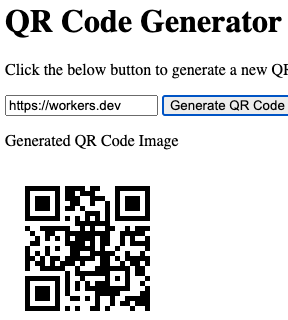
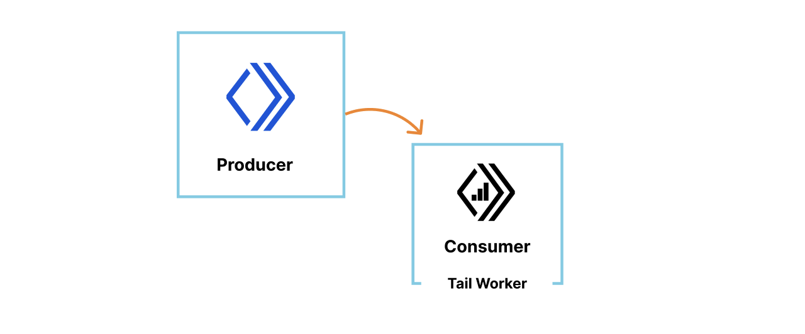
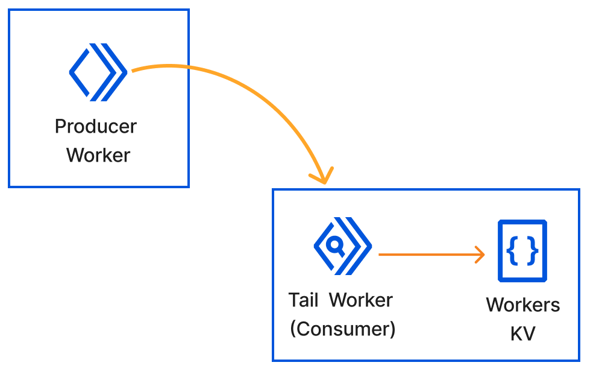
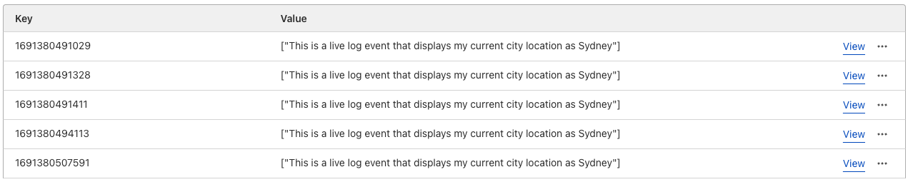

# Lab 2 - Building a QR Generator

Following on from [Lab 1](../lab1.md), this lab will extend what we learnt to leverage npm packages to extend what we can do with a Worker. The topics that will be covered in this lab are as follows:

- Generating a Worker locally
- Importing a npm module into our Worker's Script
- Publishing the Worker to the Edge
- How to rollback changes using Deployments
- Exploring Debugging options available for Workers

## Generating a Worker with Wrangler

### Creating a simple Hello World Worker

The Worker we will deploy today will generate a QR code that will point to https://workers.dev. We'll continue using the [Module Worker Syntax](https://blog.cloudflare.com/workers-javascript-modules/).

```{admonition} Wrangler Installed and Authenticated
:class: Important
Please ensure Wrangler is installed locally and authenticated as described in the [Wrangler setup guide](./wrangler.md)
```

So let's get started:

From your terminal navigate to a directory where you'd like to host your Worker's files, and then follow the steps below:

1. Generate a "Hello World" skeleton by initialising a basic Worker project with the following command and options:

```bash
npm create cloudflare@latest -- lab2

What type of application do you want to create?
 type "Hello World" script

Do you want to use TypeScript?
 typescript no

Do you want to deploy your application?
│ no

APPLICATION CREATED  Deploy your application with npm run deploy
```

The above command has initialized a basic Worker's project, with the following directory structure at the top level:

```bash
tree -L 1
.
├── node_modules
├── package-lock.json
├── package.json
├── src
└── wrangler.toml

3 directories, 3 files
```

The `src` directory contains the JavaScript for your Worker, and will be the file we use to write our code to. The second file of interest is `wrangler.toml` at the top level, this file is used to inform Wrangler which accounts, which bindings, and custom routes we'd like to use for our project. We will modify this file throughout this lab as required.

2. Next let's change into the directory, and startup [Visual Studio Code](https://code.visualstudio.com/) or another text editor of your choice.

```bash
cd lab2
code  .
```

3. For this lab we will leverage the npm module, [qr-image](https://github.com/alexeyten/qr-image), which we will use to take text and encode it into a QR code. The package supports generating the QR codes in a number of file formats, and configuring other aspects of the QR code generated. So let's get started by installing the package for use by your project:

```bash
npm install --save qr-image
```

4. Next in the file `worker.js` file in the `./src` directory add the following two lines to the top of your file:

```javascript
const qr = require('qr-image');
const url = "https://workers.dev"
```

5. Next add the `generateQRCode()` function to your script. This function receives the text from the page via a `POST`, and will return the image created using the `qr-image` module.

```javascript
async function generateQRCode(request) {
	const { text } = await request.json()
	const headers = { "Content-Type": "image/png" }
	const qr_png = qr.imageSync(text || url)

	return new Response(qr_png, { headers });
}
```

6. Add the landing page code, that you'll use to send the request to the Worker, and to see the generated QR code.


```javascript
const landing = `
<h1>QR Generator</h1>
<p>Click the below button to generate a new QR code. This will make a request to your Worker.</p>
<input type="text" id="text" value="https://workers.dev"></input>
<button onclick="generate()">Generate QR Code</button>
<p>Generated QR Code Image</p>

<script>
	function generate() {
		fetch(window.location.pathname, {
			method: "POST",
			headers: { "Content-Type": "application/json" },
			body: JSON.stringify({ text: document.querySelector("#text").value })
		})
		.then(response => response.blob())
		.then(blob => {
			const reader = new FileReader();
			reader.onloadend = function () {
				document.querySelector("#qr").src = reader.result; // Update the image source with the newly generated QR code
			}
			reader.readAsDataURL(blob);
		})
	}
</script>
`
```

7. Lastly, let's update the default fetch to listen for the `POST` event and send that request to the `generateQRCode()` function.

```javascript
export default {
	async fetch(request, env, ctx) {
		if (request.method === 'POST') {
			return generateQRCode(request)
		}

		return new Response(landing, {
			headers: {
				"Content-Type": "text/html"
			}
		})
	},
};
```

8. As we depend on an external Node library, we can either use a subset of Node.js APIs available in the Workers runtime, or add polyfills for a subset of Node.js APIs to our code. For the `qr-image` library, we'll add polyfills using Wrangler. To do so, add the following line to your `wrangler.toml` file.

```bash
node_compat = true
```

9. Check your results locally with `wrangler.dev` and when you're happy to deploy to Cloudflare, execute `wrangler deploy`. Test it works and continue to the remaining parts of this lab.

Full code snippet for the `worker.js` script is as follows

```javascript
const qr = require('qr-image');
const url = "https://workers.dev"

export default {
	async fetch(request, env, ctx) {
		if (request.method === 'POST') {
			return generateQRCode(request)
		}

		return new Response(landing, {
			headers: {
				"Content-Type": "text/html"
			}
		})
	},
};

async function generateQRCode(request) {
	const { text } = await request.json()
	const headers = { "Content-Type": "image/png" }
	const qr_png = qr.imageSync(text || url)

	return new Response(qr_png, { headers });
}

const landing = `
<h1>QR Code Generator</h1>
<p>Click the below button to generate a new QR code. This will make a request to your Worker.</p>
<input type="text" id="text" value=${url}></input>
<button onclick="generate()">Generate QR Code</button>
<p>Generated QR Code Image</p>

<script>
	function generate() {
		fetch(window.location.pathname, {
			method: "POST",
			headers: { "Content-Type": "application/json" },
			body: JSON.stringify({ text: document.querySelector("#text").value })
		})
		.then(response => response.blob())
		.then(blob => {
			const reader = new FileReader();
			reader.onloadend = function () {
				document.querySelector("#qr").src = reader.result; // Update the image source with the newly generated QR code
			}
			reader.readAsDataURL(blob);
		})
	}
</script>
`
```

Preview of the generated page should look like:



## Deployments

Deployments are a log of static historical versions of your Worker. They track changes to the bundled code, bindings, compatibility date, and usage model associated with a Worker over time. They also keep metadata associated with the deployment including the user, deploy source, timestamp, and other useful information to understand, and audit who or what is making changes to your Worker.

Key points to remember:

- Deployments can be viewed from the Cloudflare Dashboard, and Wrangler
- You can view the last 10 deployments, and rollback to any of the last 10
- Resources attached to your Worker, like KV, R2 and Durable Objects are not tracked with deployments
- New deployments are created whenever an upload, binding change, usage change, or rollback is made
- Rollbacks do not effect the local development environment, therefore make sure you use version control for your Worker
- Rollbacks are not allowed if an external resource is deleted or modified between the current version and target

Let's first view our current deployment'(s) for the lab2 Worker, by executing the command:

```bash
wrangler deployments list
 ⛅️ wrangler 3.3.0 (update available 3.4.0)
-----------------------------------------------------
🚧`wrangler deployments` is a beta command. Please report any issues to https://github.com/cloudflare/workers-sdk/issues/new/choose


Deployment ID: 6f550aa5-192e-4839-84c9-1eeddd75a8ea
Created on:    2023-07-28T02:56:40.365674Z
Author:        tsangha@cloudflare.com
Source:        Upload from Wrangler 🤠
🟩 Active
```

As you can see I have a single deployment, let's change that by making a small change to the heading (`h1`) of our HTML page in the `workers.js` script and re-deploying using the `wrangler deploy` command.

```html
<h1>QR Code Generator</h1>
```

changes to:

```html
<h1>QR Code Generator ver 2.0</h1>
```

After the changes have been deployed execute the list to see the new deployment:

```bash
wrangler deployments list
 ⛅️ wrangler 3.3.0 (update available 3.4.0)
-----------------------------------------------------
🚧`wrangler deployments` is a beta command. Please report any issues to https://github.com/cloudflare/workers-sdk/issues/new/choose


Deployment ID: 6f550aa5-192e-4839-84c9-1eeddd75a8ea
Created on:    2023-07-28T02:56:40.365674Z
Author:        tsangha@cloudflare.com
Source:        Upload from Wrangler 🤠

Deployment ID: 0f474c33-0276-45c2-bcc5-40cf3eca61eb
Created on:    2023-07-28T03:11:50.843399Z
Author:        tsangha@cloudflare.com
Source:        Upload from Wrangler 🤠
🟩 Active
```

Now let's execute a Rollback to the previous version with the `deployment-id` as required:

```bash
wrangler rollback [deployment-id]

wrangler rollback 6f550aa5-192e-4839-84c9-1eeddd75a8ea
 ⛅️ wrangler 3.3.0 (update available 3.4.0)
-----------------------------------------------------
🚧`wrangler rollback` is a beta command. Please report any issues to https://github.com/cloudflare/workers-sdk/issues/new/choose

✔ This deployment 6f550aa5 will immediately replace the current deployment and become the active deployment across all your deployed routes and domains. However, your local development environment will not be affected by this rollback. Note: Rolling back to a previous deployment will not rollback any of the bound resources (Durable Object, R2, KV, etc.). … yes
✔ Please provide a message for this rollback (120 characters max) … lab2-test

Successfully rolled back to Deployment ID: 6f550aa5-192e-4839-84c9-1eeddd75a8ea
Current Deployment ID: 2d6a1525-b142-452f-8648-b8a22fc75a3d
```
Revisit your webpage, and you should see the heading has been reverted.

## Debugging

In this debugging section, we will explore how to leverage `wrangler tail` and Tail Workers to send logs to a HTTP endpoint for debugging, which are two components of the debugging tools we have built into the platform.

### Wrangler Tail

To access logs and exceptions from your Workers, one of the most convenient methods to do so is by using `wrangler tail`. This allows you livestream logs from any Worker straight to your terminal.

```{admonition} Cloudflare Dashboard
:class: Info
You are also able to livestream logs to your Cloudflare dashboard on-demand if `wrangler` is not available
```

1. Let's begin by adding a custom log statement to our lab2 Worker's code, so we can see something meaningful. Using the `console.log` statement, let's add the following code to our `async fetch` code block in the `workers.js` script.

```javascript
export default {
	async fetch(request, env, ctx) {
		const cf = request.cf
		console.log(`This is a live log event that displays my current city location as ${cf.city}`)

		if (request.method === 'POST') {
			return generateQRCode(request)
		}
...
```

2. Re-deploy your worker and start a tail session

```bash
wrangler deploy
wrangler tail
wrangler tail
 ⛅️ wrangler 3.3.0 (update available 3.4.0)
-----------------------------------------------------
Successfully created tail, expires at 2023-07-28T09:35:15Z
Connected to lab2, waiting for logs...
```

3. Navigate in your browser to your Worker, and you should now see the following logs appear:

```bash
GET https://lab2.apjc-dev.workers.dev/ - Ok @ 28/07/2023, 1:41:24 pm
  (log) This is a live log event that displays my current city location as Sydney
GET https://lab2.apjc-dev.workers.dev/ - Ok @ 28/07/2023, 1:41:24 pm
  (log) This is a live log event that displays my current city location as Sydney
GET https://lab2.apjc-dev.workers.dev/favicon.ico - Ok @ 28/07/2023, 1:41:24 pm
  (log) This is a live log event that displays my current city location as Sydney
```

```{admonition} Tail any Worker
:class: Info
To tail a different Worker in your account, the command syntax is as follows: `wrangler tail [worker-name]`
```

### Tail Workers (optional)

Tail Workers is an optional part of this lab, and is available on Workers Paid on Enterprise Tiers only. A Tail Worker receives information about the execution of other Workers, such as:

- HTTP statuses
- `console.log()` messages
- uncaught exceptions

A Tail Worker is tied to another Worker known as the producer Worker (your primary application Worker) that the Tail Worker will track as seen in the diagram below:



The Tail Worker will capture all events associated witht he producer Worker once it has finished executing.

In this section of the lab, we'll configure a Tail Worker to receive logs from our Lab 2 Worker which will be the producer now, and put those logs into Workers KV. You could send the logs received by the Tail Worker to a different endpoint as well.

The diagram below depicts what we'll create:




#### Create a Tail Worker

Let's now create a new Worker in your source directory, called **lab2_tail_worker**. Follow the instructions in the [first section](#creating-a-simple-hello-world-worker) to get started. Once you have the Hello World skelton setup, modify the `worker.js` script in the `src` directory, and copy the following code snippet:

```javascript
export default {
	async tail(events, env, ctx) {

		/*
			timestamp = key value for KV
			logMessage = console.log() message from producer Worker
			put values for every request into the same keyvalue store
		*/
		const timestamp = events[0].eventTimestamp
		const logMessage = JSON.stringify(events[0].logs[0].message)

		const setCache = (key, data) => env.lab2_tail_worker_kv.put(key, data)
		await setCache(timestamp, logMessage)
	}
}
```

After you've done that and saved the file, create a KV namespace called: `lab2_tail_worker_kv`. The Wrangler command is as follows:

```bash
wrangler kv:namespace create "lab2_tail_worker_kv"
```

The last step is to configure the Tail Worker's `wrangler.toml` file to use the KV namespace we created by adding a binding. Ensure you substitute the `id` for your specific environment. The KV binding should look as follows:

```bash
kv_namespaces = [
  { binding = "lab2_tail_worker_kv", id = "MY_UNIQUE_ID"}
]
```

Save your Tail Worker files and deploy using the command: `wrangler deploy`.

After deploying your Worker, the last remaining step is to add the following line to your original lab2 Worker's `wrangler.toml` file.

```bash
tail_consumers = [{service = "lab2_tail_worker", environment = "production"}]
```

Make sure you execute `wrangler deploy` on the lab2 Worker for the changes to take effect. Once you've done that, visit the URL for your lab2 Worker to generate entries to your KV namespace.

Once done, you should see entries on your KV namespace like the following Wrangler command or figure:


```bash
wrangler kv:key list --namespace-id=MY_UNIQUE_ID
[
  {
    "name": "1691380491029"
  },
  {
    "name": "1691380491328"
  },
  {
    "name": "1691380491411"
  },
  {
    "name": "1691380494113"
  },
  {
    "name": "1691380507591"
  }
]
```



