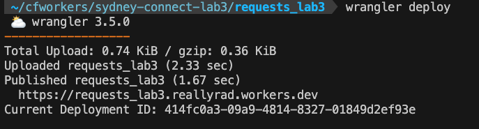
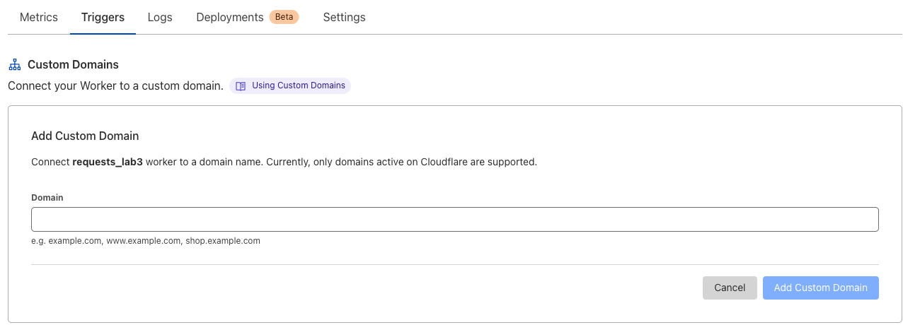
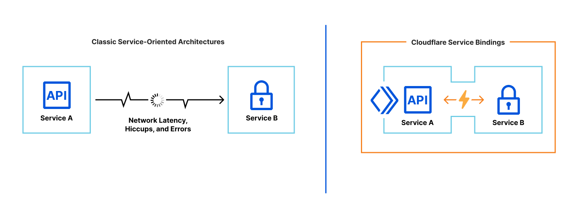
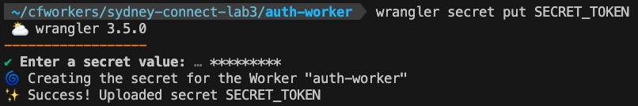
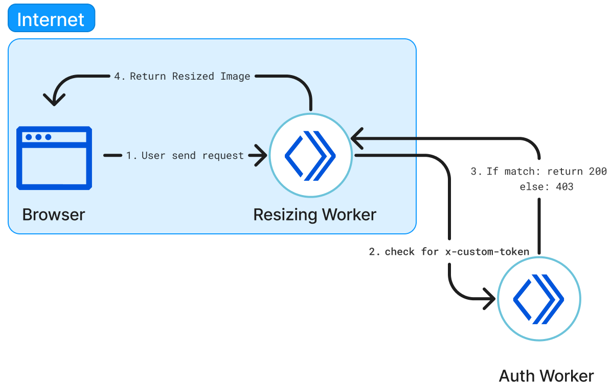
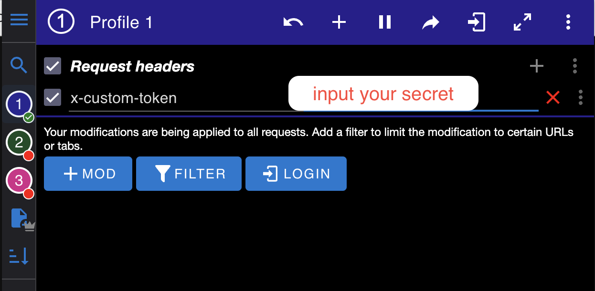

# Lab 3 - Manipulating Requests using Workers

In this lab we will explore how to resize images using workers and make use of Cloudflare Worker's service binding to send sub-requests to another worker to perform Authentication.

Goals of the lab:
* Deploy Worker to Cloudflare's Edge
* How to use Cloudflare's Fetch API
* Resize an image using a Worker
* How to leverage Service Binding's between Worker's

```{admonition} Wrangler Installed and Authenticated
:class: Important
Please ensure Wrangler is installed locally and authenticated as described in the [Wrangler setup guide](./wrangler.md)
```

## Generating an Image-Resizing Worker

### Initialise a "Hello World" Worker

1. Create the initial "Hello World" Worker skeleton, with the following command:

```bash
npm create cloudflare@latest -- requests_lab3

What type of application do you want to create?
 type "Hello World" script

Do you want to use TypeScript?
 typescript no

Do you want to deploy your application?
│ no

APPLICATION CREATED  Deploy your application with npm run deploy
```

 2. Change into working directory, start-up Visual Studio Code, or any other editor of your choice:

```bash
cd requests_lab3
code  .
```

### Specify source image and resizing options

1. On the `worker.js` file, replace the exiting code content with following code:

```javascript
export default {
	async fetch(request, env, ctx) {
		const srcImage = "https://r2.nathanneotechproject.me/crazy-cat"
		const options = {
			cf: {
			  image: {
				border: {
				  color: "#0df2c9",
				  width: 200
				},
				blur: 5
			  }
			}
		  }
		let imageResponse = await fetch(srcImage, options)
		if (imageResponse.ok || imageResponse.redirected) { // fetch() may respond with status 304
			return imageResponse
		  } else {
			return imageResponse.redirect(srcImage, 307)
		  }
	}
}
```

Breaking down the code:

- You can specify any source image, otherwise you can use the default image link that is hosted on Cloudflare R2.
`const srcImage = "https://r2.nathanneotechproject.me/crazy-cat"`

- The `fetch()` function accepts parameters in the second argument inside the `{cf: {image: {…}}} object`. Here we can specify the Fetch options such as: `border, blur and width`. For a full list of available options refer to [Fetch Options](https://developers.cloudflare.com/images/image-resizing/resize-with-workers/#fetch-options).

```javascript
const options = {
	cf: {
		image: {
		border: {
			color: "#0df2c9",
			width: 200
		},
		blur: 5
		}
	}
}
```

- Using `async` and `await`

`let imageResponse = await fetch(srcImage, options)`. In the fetch function we pass in two argument, source image link `srcImage` and the resizing options under `options`.  Because of the `await` keyword, the asynchronous function pauses until the promise is resolved. The `Response` object is assigned to `response(imageResponse)`` once the request completes.

- Returning the resized image and handling errors

```javascript
if (imageResponse.ok || imageResponse.redirected) { // fetch() may respond with status 304
			return imageResponse
		  } else {
			return imageResponse.redirect(srcImage, 307)
		  }
	}
```

In this code snippet, we implement error handling by using `.ok` to check the response, if there is an error we will return and redirect to the image source with a HTTP status code of 307.

### Deploy your worker to Cloudflare's edge

1. Run `wrangler deploy` in your CLI



When you create your Worker, the workers.dev route is automatically set up.
You can review this in your Cloudflare Dashboard under `Worker > Triggers > Routes`.

2. Now open the worker that is executing on the `workers.dev` route, is the image being resized? The answer is **No**, this is because Cloudflare Image Resizing is only available when attached to a Custom Domain with Image Resizing enabled on a specific Zone.

### Connect Worker to a Custom Domain

1. On the Cloudflare Dashboard navigate to your Worker; `Worker > Triggers > Custom domain`.
2. Click on 'Set up a custom domain', otherwise you will need to purchase a domain.



After adding custom domain, you will need to wait a few seconds for the Certificate to be Active. Once active click on the domain, and you should see the image that is successfully resized, as per the image below:


## Service Binding

Since your domain is now public and on the Internet, to restrict access to your Worker we can implement another Worker to perform authorization via a custom token. This will require the use of a Service Binding between the two Workers.

**Hold up!** Before we do that... what is Service Binding?

Service Bindings are an API that facilitate Worker-to-Worker communication via explicit bindings defined in your configuration.

A Service binding allows you to send HTTP requests to another Worker without those requests going over the Internet. The request immediately invokes the downstream Worker, reducing latency as compared to a request to a third-party service. You can invoke other Workers directly from your code. This makes it possible to communicate with shared services managed by other teams with differing test and release processes. Those services do not need to be hooked up to publicly accessible endpoints. Service bindings facilitate private services to communicate with one another.

Service bindings allow you to:

* Segment multiple use cases into separate Workers that can be explicitly invoked from your code.
* Achieve better compostability on the Workers platform using service-oriented architecture.
* Create private microservices, to be conditionally invoked from other global network-facing services.



To configure a Service binding in your `wrangler.toml`, refer to the following syntax:
```bash
services = [
  { binding = "<BINDING_NAME>", service = "<WORKER_NAME>", environment = "<ENVIRONMENT_NAME>" }
]
```
The `wrangler.toml` options are:

- `binding`: Variable name for the binding in your Worker code, accessible under the `env` parameter in ES module format Workers, or in the global scope in Service Worker syntax.
- `service`: Name of the target Worker you would like to communicate with. This Worker should be under the same Cloudflare Account.

Since we do not have a target Worker, we will need to deploy it first.

### Generate an Auth Worker

1. On your CLI run:

```bash
npm create cloudflare@latest -- auth-worker

What type of application do you want to create?
 type "Hello World" script

Do you want to use TypeScript?
 typescript no

Do you want to deploy your application?
│ no

APPLICATION CREATED  Deploy your application with npm run deploy
```

**Note:** `cd` into the correct working directory, since we are working on a new Worker

```bash
cd auth_worker
code  .
```

2. Next we'll Implement token logic on Auth Worker. So in your `worker.js` file replace it with the following code:

```javascript
export default {
	async fetch(request, env) {
	  // Read x-custom-token header and make sure it matches SECRET_TOKEN
	  if (request.headers.get('x-custom-token') === env.SECRET_TOKEN) {
		return new Response('Request allowed', { status: 200 });
	  } else {
		return new Response('x-custom-token does not match, request not allowed', { status: 403 });
	  }
	},
  };
```

The authentication Worker code above responds with a status code 200 when `x-custom-token` in the incoming request matches a `SECRET_TOKEN` secret binding. 

**Note:** that we implement fetch here, since a Service binding will invoke FetchEvent on the target Worker.


### Create a secret variable and deploy Auth worker

3. Open CLI and run: `wrangler secret put SECRET_TOKEN`
This will prompt for a secret value: *******


4. Deploy your worker, run: `wrangler deploy`

### Create service binding

**Note:** `cd` back into the first Worker that we created:

```bash
cd requests_lab3
code .
```

5. Open up the `wrangler.toml` file and add the service binding as follow:

```toml
services = [
  { binding = "auth", service = "auth-worker" }
]
```

In the example above, the Service bindings for the authentication Workers are accessible in code via `env.auth`. Respectively when using ES modules format, or globally at `auth` when using Service Worker syntax.


6. Open `worker.js` and add the following line of code in the `fetch` function

Once added, the resizing Worker(requests_lab3) can access the Workers Service binding directly from the code, as in the example below. It utilizes the fetch API.

```javascript
export default {
	async fetch(request, env, ctx) {
		 // Fetch AUTH service and pass request
		 const authResponse = await env.auth.fetch(request.clone());

		 // Return response from the AUTH service if the response status is not 200
		 // It would return 403 'x-custom-token does not match, request not allowed' response in such case
		 if (authResponse.status !== 200) {
		   return authResponse;
		 }
```

In this setup, only the resizing Worker is exposed to the Internet and privately communicating with the auth Worker using Service bindings.




7. Update the changes by running: `wrangler deploy`

### Test service binding

Accessing the domain and you will be greeted with: `x-custom-token does not match, request not allowed`

To modify the HTTP header on Chrome, you can use the 

Add your secret to `x-custom-token` header, by clicking `+ Mod`
Name: `x-custom-token` , Value: `your secret`


Simply hit refresh the page and you are able to access your domain now.

**Congrats! You made it to the end of Lab 3**

## More information

For more information on Image Resizing and Service Bindings, check out the following links:

- [Resizing with Cloudflare Worker](https://developers.cloudflare.com/images/image-resizing/resize-with-workers/)
- [Custom Domains](https://developers.cloudflare.com/workers/configuration/routing/custom-domains/#custom-domains)
- [About Service Bindings](https://developers.cloudflare.com/workers/configuration/bindings/about-service-bindings/)


