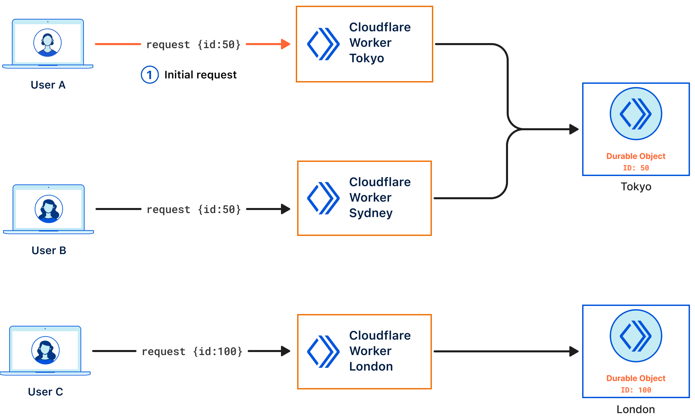

# Lab 4 - Chat Application

This lab will expose you to using Durable Objects with Cloudflare Workers, and WebSockets to build a chat application that runs entirely on Cloudflare's Edge Network. 

As you know, Workers on their own are considered stateless, and therefore we need a mechanism to store and coordinate the chat messages between multiple participants. This is where Durable Objects come in, they are used to coordinate events between our chat participants, and store those messages. 

```{admonition} Workers Paid Plan
:class: Info
Durable Objects are only available on the Workers Paid plan. The Workers Paid plan includes Workers, Pages Functions, Workers KV, and Durable Objects usage for a minimum charge of $5 USD per month for an account.
```

## Background on Durable Objects

Here are some key points to remember about Durable Objects:

- Durable Objects provide low-latency coordination, and consistent storage for the Workers Platform
- Only a Worker can access a Durable Object, it cannot be accessed by any other mechanism
- A Durable Object is created and stored at the closet Cloudflare region from where the first request for it was received
- Each Durable Object is considered **globally unique**; there is only ever a single instance running on a given ID anywhere in the world
	- All Workers that make sub-requests to a specific Durable Object ID, are routed to the same instance, whether the request comes in from one geographic location or another
- Execution of a Durable Object is single-threaded, but multiple request events may still be processed out-of-order from how they arrived at the object
- Durable Objects also has access to a persistent **Transactional Storage API**

The following diagram provides an illustration of how requests from users are routed to the closet Cloudflare POP depending on the Durable Object ID they are accessing. So for example:

- User A initiates the first request (`id:50`), and as such the instance of the Durable Object is instantiated there. 
- User B's subsequent request (`id:50`) although is processed by a Worker in Sydney, is sent to the Durable Object in Tokyo as the first request meant it was created in the Tokyo region. 
- Other Durable Objects that have a different unique ID follow the same process for that respective region. 



For in-depth information, please refer to the [Durable Objects Developer Docs](https://developers.cloudflare.com/durable-objects/)

## How the App Works

So let's start with how the application works. The chat application uses a Durable Object to control each chat room. Users connect to the chat room by specifying the room name, and are then connected to the Durable Object using WebSockets. Messages from one user are broadcast to all the other users, and the chat history is saved in the Durable Object using the storage layer. 

Additionally, this demo uses Durable Objects for a second purpose: Applying a rate limit to messages from any particular IP. Each IP is assigned a Durable Object that tracks recent request frequency, so that users who send too many messages can be temporarily blocked -- even across multiple chat rooms. Interestingly, these objects don't actually store any durable state at all, because they only care about very recent history, and it's not a big deal if a rate limiter randomly resets on occasion. So, these rate limiter objects are an example of a pure coordination object with no storage.

This chat app is only a few hundred lines of code. The deployment configuration is only a few lines. Yet, it will scale seamlessly to any number of chat rooms, limited only by Cloudflare's available resources. Of course, any individual chat room's scalability has a limit, since each object is single-threaded.

## Deploying the Chat Application

For this demo we'll clone an existing Git. 

1. Git clone the following repo into your code folder, and we'll call in Lab 4. 

Clone via SSH:
```bash
git clone git@github.com:cloudflare/workers-chat-demo.git lab4
```

Clone via HTTPs:
```bash
git clone https://github.com/cloudflare/workers-chat-demo.git lab 4
```

2. Modify the `wrangler.toml` file to add in your account id.

```bash
account_id = "ACCOUNTID"
```

3. Deploy your Worker to the Edge

```bash
wrangler deploy
 ⛅️ wrangler 3.5.0
------------------
Your worker has access to the following bindings:
- Durable Objects:
  - rooms: ChatRoom
  - limiters: RateLimiter
Total Upload: 19.41 KiB / gzip: 5.65 KiB
Uploaded edge-chat-demo (1.67 sec)
Published edge-chat-demo (3.79 sec)
  https://edge-chat-demo.apjc-dev.workers.dev/
Current Deployment ID: a7b2edc6-fa69-4c61-b9d0-11cd9406c43a
```

4. Read through the code in `./src/chat.mjs` to see how the Chat Server is implemented


```{admonition} Compatibility Date
:class: Info
In the `wrangler.toml` file you may have noticed the `compatibility_date = "2021-11-08"` date flag. As Cloudflare updates the Workers runtime on a regular basis, it may be beneficial to lock in the runtime to a specific version before the given date. For more information refer to [Compatibility Dates](https://developers.cloudflare.com/workers/configuration/compatibility-dates/#compatibility-flags) 
```

## More Information

For more information on Durable Objects, check out the following links:

- [Introductory Blog Post](https://blog.cloudflare.com/introducing-workers-durable-objects/)
- [Durable Object Alarms - Scheduling](https://blog.cloudflare.com/building-scheduling-system-with-workers-and-durable-objects/)
- [Building real-time games using Workers, Durable Objects, and Unity](https://blog.cloudflare.com/building-real-time-games-using-workers-durable-objects-and-unity/)
- [Durable Objects Documentation](https://developers.cloudflare.com/durable-objects/)
- [Durable Objects Discord Channel](https://discord.com/channels/595317990191398933/773219443911819284)
